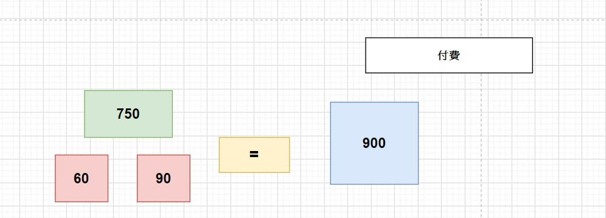
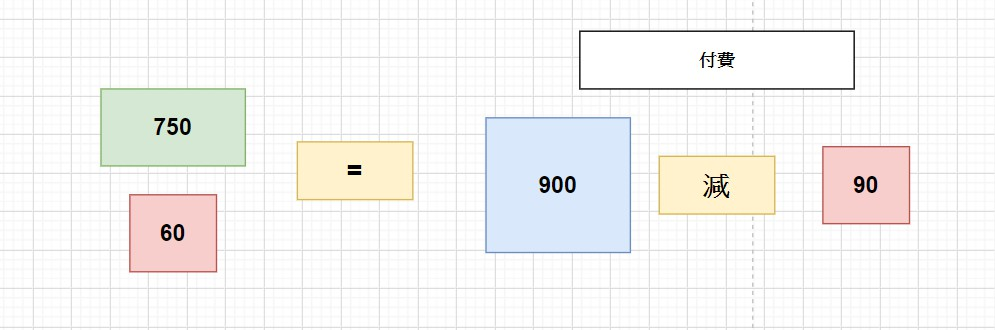
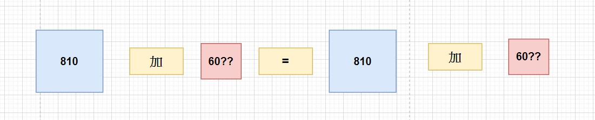

# 加法並無意義
今天門票費750元服務生拿走60元加起來等810元，810元已經包含了60，所以810 + 60 完全沒有意義。
## 圖像化
### 1. 今天付了900源的情況

> 60元被服務生拿走90元還回去

### 2. 付了還回去後因為右邊的金額是付費所以是減

### 3. 最後結果

​	最後加60能代表的意義僅為他們他們三個要再多付60元，如果要算成原來他們付的總價錢(也就是900元)，也是要從還給他們的90塊加上付出的810。
​	而810其實是包含真實票價750以及服務生拿走的60元構成，已經被算在裡面，再加60並無道理。

